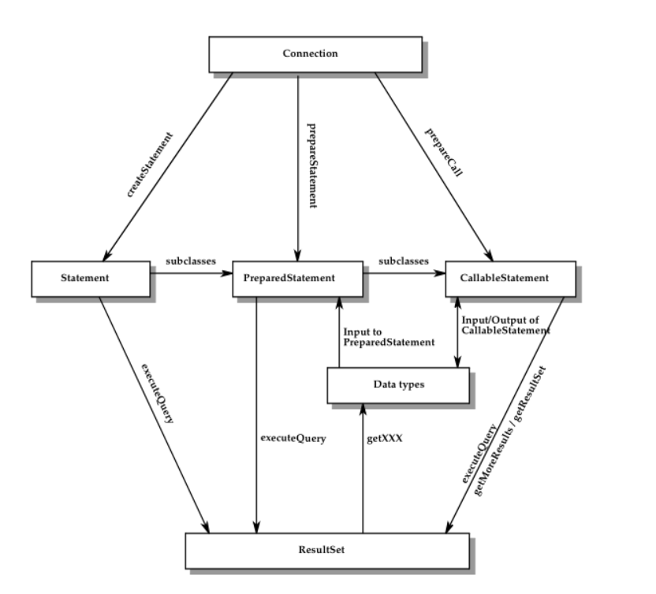

**  **
# jdbc规范
这个是java定义的一套连接操作数据库的规范 
1. JDBC 1.0 随JDK1.1发布；
2. JDBC 2.0 随JDK1.2 和 JDK1.3 发布
 JDBC 2.0 和 JDBC 2.1 API 被分入两个包：
java.sql 包（包括核心 API；它是 JDBC 1.22 API 的增强）
javax.sql 包（可选的包，用于支持连接池、分布式事务及其他类似的高级功能）。
J2SE（Java 2，标准版，在 JDK 1.2 及更高版本中实现）支持 JDBC 2.0 和 JDBC 2.1 核心 API，J2EE 1.3 支持 JDBC 2.0 可选包。
3. JDBC3.0 随JDK1.4发布
JDBC 3.0 最终于 2002 年 5 月完成，并已合并入 J2SE 1.4 和 J2EE 1.4。
从JDBC 3.0 开始有对应的jsr规范（jsr是Java Specification Request 的缩写，意思是Java 规范提案） https://jcp.org/en/jsr/detail?id=54
4. JDBC 4.0 随 JDK1.6 发布
从JDBC4.0开始有对应的JDBC API规范，同时也整合之前的一些规范信息 https://jcp.org/en/jsr/detail?id=221
5. JDBC4.1 随 JDK1.7 发布
6. JDBC4.2 随 JDK1.8 发布
7. 关于各个版本jdk对jdbc规范的支持
<pre>
JDK 1.1-JDBC 1.请注意，在8.0版中，对JDBC 1的支持已被删除，因此请在更新服务器时更新JDK。
JDK 1.2、1.3-JDBC 2。
JDK 1.3 + J2EE-JDBC 2 EE。它包含对javax.sql类的附加支持。
JDK 1.4、1.5-JDBC3。它包含对SSL和javax.sql的支持，但由于它已添加到J2SE发行版中，因此不需要J2EE。
JDK 6-JDBC 4.0对JDBC4方法的支持不完整，但是大多数方法已实现。
JDK 7-JDBC 4.1对JDBC4方法的支持不完整，但是大多数方法已实现。
JDK 8-JDBC 4.2对JDBC4方法的支持尚未完成，但是大多数方法已实现。
</pre>
给出jdbc3 和jdbc4的一些新的特性 

## 关于jdbc3 的一些新特性
- Savepoint support 
Added the Savepoint interface, which contains new methods to set, release, or
roll back a transaction to designated savepoints.(添加了Savepoint接口，该接口包含用于将事务设置，释放或回滚到指定保存点的新方法。就是可以回滚到指定的保存点) 
- I Reuse of prepared statements by connection pools 
Added the ability for deployers to control how prepared statements are pooled
and reused by connections.(为部署者增加了控制连接如何合并和重用准备好的语句的功能。) 
- I Connection pool configuration 
Defined a number of properties for the ConnectionPoolDataSource interface.
These properties can be used to describe how PooledConnection objects
created by DataSource objects should be pooled.(为ConnectionPoolDataSource接口定义了许多属性。这些属性可用于描述应如何合并由DataSource对象创建的PooledConnection对象。) 
- I Retrieval of parameter metadata 
Added the interface ParameterMetaData, which describes the number, type
and properties of parameters to prepared statements.(添加了ParameterMetaData接口，该接口描述了准备好的语句的参数数量，类型和属性。) 
- I Retrieval of auto-generated keys 
Added a means of retrieving values from columns containing automatically
generated values.(添加了一种从包含自动生成的值的列中检索值的方法。) 
- I Ability to have multiple open ResultSet objects 
Added the new method getMoreResults(int), whichtakes an argument that
specifies whether ResultSet objects returned by a Statement object should be
closed before returning any subsequent ResultSet objects.(添加了新方法getMoreResults（int），该方法带有一个参数，该参数指定在返回任何后续ResultSet对象之前是否应关闭Statement对象返回的ResultSet对象。) 
- Passing parameters to CallableStatement objects by name 
Added methods to allow a string to identify the parameter to be set for a
CallableStatement object.(添加的方法允许字符串标识要为CallableStatement对象设置的参数) 
- I Holdable cursor support 
Added the ability to specify the of holdability of a ResultSet object.
- I BOOLEAN data type 
Added the data type java.sql.Types.BOOLEAN. BOOLEAN is logically equivalent to BIT. 
- I Making internal updates to the data in Blob and Clob objects 
Added methods to allow the data contained in Blob and Clob objects to be altered. 
- I Retrieving and updating the object referenced by a Ref object 
Added methods to retrieve the object referenced by a Ref object. Also added the ability to update a referenced object through the Ref object. 
- I Updating of columns containing BLOB, CLOB, ARRAY and REF types 
Added of the updateBlob, updateClob, updateArray, and updateRef methods to the ResultSet interface. 
- I DATALINK/ URL data type 
Added the data type java.sql.Types.DATALINK, allowing JDBC drivers to store and retrieve references to external data. 
- I Transform groups and type mapping 
Described the effect of transform groups and how this is reflected in the meta-data. 
- I Relationship between the JDBC SPI (Service Provider Interface) and the 
Connector architecture Described the relationship between the JDBC SPI and the connector architecture in Chapter 19 “Relationship to Connectors”. 
- I DatabaseMetadata APIs 
Added metadata for retrieving SQL type hierarchies. See the JDBC API Specification for details.
 

## 关于jdbc4 的一些新特性
- I Added support for REF CURSOR. 
The REF CURSOR data type is supported by several databases to return a result set from a stored procedure. 
- I Support for large update counts 
JDBC methods that return an update count currently return an int value.
This has caused problems as DataSets continue to grow, in certain environments. 
- I Addition of the java.sql.DriverAction interface 
This interface may be implemented by a driver that wants to be notified by DriverManager when the driver is deregistered. 
- I Addition of the java.sql.SQLType interface 
An interface used to create an object that represents a generic SQL Type,called a JDBC type or a vendor specific type. 
- I Addition of the java.sql.JDBCType Enum 
An Enum used to identify generic SQL Types, called JDBCType. The intent is to use JDBCType in place of the constants, defined in Types.java. 
*后面都是对java8中时间的新的类型映射*
- I Additional Mappings to Table B-4, Mapping from Java Object to JDBC Types 
Added support to map java.time.LocalDate to JDBC DATE.
Added support to map java.time.LocalTime to JDBC TIME
12 JDBC 4.2 Specification • March 2014
Added support to map java.time.LocalDateTime to JDBC TIMESTAMP.
Added support to map java.time.LocalOffsetTime to JDBC
TIME_WITH_TIMEZONE.
Added support to map java.time.LocalOffsetDateTime to JDBC
TIMESTAMP_WITH_TIMEZONE.
I Additional Mappings to Table B-5, Performed by setObject and setNull between
Java Object Types and Target JDBC Types
Allow conversion of java.time.LocalDate to CHAR, VARCHAR,
LONGVARCHAR, and DATE.
Allow conversion of java.time.LocalTime to CHAR, VARCHAR,
LONGVARCHAR, and TIME.
Allow conversion of java.time.LocalTime to CHAR, VARCHAR,
LONGVARCHAR, and TIMESTAMP.
Allow conversion of java.time.OffsetTime to CHAR, VARCHAR,
LONGVARCHAR, and TIME_WITH_TIMESTAMP.
Allow conversion of java.time.OffsetDateTime to CHAR, VARCHAR,
LONGVARCHAR, TIME_WITH_TIMESTAMP and
TIMESTAMP_WITH_TIMESTAMP.
I Additional Mappings to Table B-6, Use ResultSet getter Methods to retrieve JDBC
Types
Allow getObject to return TIME_WITH_TIMEZONE,
TIMESTAMP_WITH_TIMEZONE. 
- I JDBC API changes 
The following changes were made to existing JDBC interfaces.. 
- I BatchUpdateException 
Added a new constructor to support large update counts.
Added the method getLargeUpdateCounts. 
- I Connection 
Added the methods abort,getNetworkTimeout, getSchema,
setNetworkTimeout, setSchema.
Clarified the getMapType, setSchema, setMapType methods. 
- I CallableStatement 
Overloaded the registerOutParameter and setObject methods.
Clarified the getObject methods. 
- I Date
Added the methods toInstant, toLocalDate 
Chapter 3 Summary of New Features 13
Overload the method valueOf
- I DatabaseMetaData 
Added the methods supportsRefCursor, getMaxLogicalLobSize.
Clarified the getIndexInfo method. 
- I Driver 
Clarified the acceptsURL, and connect, methods 
- I DriverManager 
Overload the registerDriver method.
Clarified the getConnection, deregisterDriver, and
registerDriver, methods. 
- I PreparedStatement 
Added the method executeLargeUpdate.
Overload the method setObject. 
- I ResultSet 
Overloaded the methods updateObject.
Clarified the getObject methods. 
- I Statement 
Added the method executeLargeBatch, executeLargeUpdate.
getLargeUpdateCount, getLargeMaxRows, and setLargeMaxRows.
Clarified the setEscapeProcessing method. 
- I SQLInput 
Added the readObject method. 
- I SQLOutput 
Added the readObject method 
- I Time
Added the methods toInstant, toLocalTime
Overload the method valueOf 
- I Timestamp 
Added the methods from, toInstant, toLocalTime
Overload the method valueOf. 
- I Types 
Added the types REF_CURSOR, TIME_WITH_TIMEZONE, and
TIMESTAMP_WITH_TIEMZONE. 
- I SQLXML
14 JDBC 4.2 Specification • March 2014
Clarified the getSource and setResult methods. 
- I DataSource and XADataSource
Clarified that a no-arg constructor must be provided 

## 关于常用的数据库的驱动说明地址
### pg
https://jdbc.postgresql.org/download.html#current
### oracle
https://www.oracle.com/database/technologies/appdev/jdbc-downloads.html

**总之使用什么jdk 就应该使用对应版本之上的驱动版本 不然可能出现问题**

## jdbc驱动使用流程图

## jdbc 规范api
- 主要分为两个包 一个是 java.sql 是一个核心包 还有一个javax.sql
<pre>
下面列出一些javax.sql 一些类，其实就是jdbc2 规范中的 对jdbc的扩展的功能
javax.sql.CommonDataSource
javax.sql.ConnectionEvent
javax.sql.ConnectionEventListener
javax.sql.ConnectionPoolDataSource
javax.sql.DataSource
javax.sql.PooledConnection
javax.sql.RowSet
javax.sql.RowSetEvent
javax.sql.RowSetInternal
javax.sql.RowSetListener
javax.sql.RowSetMetaData
javax.sql.RowSetReader
javax.sql.RowSetWriter
javax.sql.StatementEvent
javax.sql.StatementEventListener
javax.sql.XAConnection
javax.sql.XADataSourc
</pre>

## 关于 DatabaseMetaData 接口 
<pre>
定义了 140 个方法 和40 属性 
这个数据库开发生实现驱动的时候可以通过这个类 ，告诉使用者 数据库的一些特性 以及驱动是否能够实现一些规范中要求的功能
</pre> 

## 关于 connection
### 得到一个connection实例

### Connection Pooling
连接池通过维护可在客户端会话之间重用的物理数据库连接的缓存来解决此问题。 连接池极大地提高了性能和可伸缩性，尤其是在三层环境中，其中多个客户端可以共享较少数量的物理数据库连接。
在图11-1中，JDBC驱动程序提供了ConnectionPoolDataSource的实现，应用程序服务器使用该实现来构建和管理连接池。

值得一提的是两个类ConnectionPoolDataSource PooledConnection,这两个类是通过jndi使用的 

##  关于事务 
### 关于事务自动提交 

352/5000
Connection属性自动提交指定何时结束事务。 启用自动提交会在每个单独的SQL语句完成后立即进行事务提交。 一条语句被视为“完整”的点取决于SQL语句的类型以及应用程序在执行之后的操作：

结束自动提交需要手动提交事务 
### 事务等级 
#### 数据查询出现的问题
脏读 不可重复读 幻读 
事务隔离级别指定事务中的语句“可见”哪些数据。 通过定义针对同一目标数据源的事务之间可能进行的交互（如果有），它们直接影响并发访问的级别。 并发事务之间的可能交互分类如下：

- 当允许事务查看未提交的数据更改时，就会发生脏读。 换句话说，在事务内部进行的更改在提交之前在事务外部可见。 如果更改被回滚而不是被提交，则其他事务可能基于不正确的瞬态数据完成工作。
- 在以下情况下发生不可重复的读取：
    a. Transaction A reads a row 
    b. Transaction B changes the row 
    c. Transaction A reads the same row a second time and gets different results 
- 幻读取发生在  
    a. Transaction A reads all rows that satisfy a WHERE condition 
    b. Transaction B inserts an additional row that satisfies the same condition 
    c. Transaction A reevaluates the WHERE condition and picks up the additional
    “phantom” row       
    
#### jdbc 事务等级
JDBC通过添加TRANSACTION_NONE增强了SQL：2003定义的四个级别的事务隔离。 从最低限制到最高限制，事务隔离级别为：
- TRANSACTION_NONE — indicates that the driver does not support transactions,
  which means that it is not a JDBC compliant driver.
- TRANSACTION_READ_UNCOMMITTED — allows transactions to see uncommitted
  changes to the data. This means that dirty reads, nonrepeatable reads, and
  phantom reads are possible.
- TRANSACTION_READ_COMMITTED — means that any changes made inside a
  transaction are not visible outside the transaction until the transaction is
  committed. This prevents dirty reads, but nonrepeatable reads and phantom
  reads are still possible.（随着事务隔离级别的提高，需要更多的锁定和其他DBMS开销来确保正确的语义。 反过来，这降低了可以支持的并发访问的程度。 结果，当应用程序使用较高的事务隔离级别时，它们的性能可能会下降。 因此，事务管理器，无论是应用程序本身还是应用程序服务器的一部分，都应在确定哪种事务隔离级别合适时权衡对数据一致性的需求和对性能的要求。  一般我们将事务设置到这里就可以了 设置越高级维护越消耗资源）
- TRANSACTION_REPEATABLE_READ — disallows dirty reads and nonrepeatable
  reads. Phantom read are still possible.
- TRANSACTION_SERIALIZABLE — specifies that dirty reads, nonrepeatable reads,
  and phantom reads are prevented.
  
*<b>通过connection类的 setTransactionIsolation 方法可以设置事务的等级*
#### Savepoints
通过设置保存点 可以更加细粒度控制事务
通过 connection调用

<pre>Connection.releaseSavepoint 
删除保存点
Connection.releaseSavepoint方法将Savepoint对象作为参数，并将其以及当前事务中的所有后续保存点删除。
释放保存点后，尝试在回滚操作中引用该保存点将导致引发SQLException。
在提交事务或回滚整个事务时，将自动释放在事务中创建的所有保存点，并使其无效。
将事务回滚到保存点会自动释放，并使在该保存点之后创建的任何其他保存点无效
</pre>

#### 分布式事务 

从图中可以看到使用同一个事务管理，比如我们使用jta事务的时候 使用 UserTrancation 来作为多个连接的事务管理器
在我写的很多代码都是单一操作数据库连接，并没有存在一个方法快中同时使用了n个服务的情况 ，jta事务在公司用的比较少见，但是真的对应分模块的应用来说分布式事务确实需要非常重视

### statement 执行引擎
也就调用存储过程特别，其他并没有什么特别的注意点

### resultset 返回结果 
